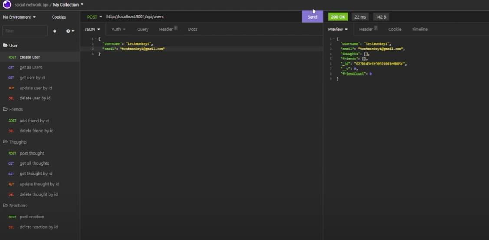

## Social Network API

  

  #### Table of Contents
  
  1. [Description](#description)
  2. [Installation Instructions](#installation-instructions)
  3. [Usage Information](#usage-information)
  4. [Contributor Guidelines](#contributor-guidelines)
  5. [Test Instructions](#test-instructions)
  6. [License](#license)
  7. [Questions](#questions)
  
  ## Description
  * This program features backend code for a Social Network website that enables the user to view, add, update, and delete categories, products, and tags. It uses the following NPM packages through Node.js:
  * Express
  * Mongoose
  * Moment

  The database this backend uses is MongoDB. You can use MongoDB Compass to look at the data of this program.
  
  ## Installation Instructions
  * In order to install this program, you must have node.js and MongoDB installed first. Download this repository and access it in your terminal of choice. When you are in the root folder enter "npm install" in the terminal to install all necessary packages. Afterwards, type "npm start" into the prompt to begin the program. Use Insomnia to easily test the functionality of this program.

  * Watch the video on how to install this program and get it running [here](https://www.youtube.com/watch?v=HZftd_BYRqk)
  
  
  ## Usage
  * Use this program as a backend for your own Social Network website.
  
  ## Contributor Guidelines
  * Currently, no contributions necessary.
  
  ## Test Instructions
  * No testing through Node, but it is recommended you use Insomnia to test this program. Watch the walkthrough video for more info.
  
  ## License
  * The application is covered under the following license:
    [mit](https://choosealicense.com/licenses/mit)
  
  ## Questions
  * Follow me on GitHub for updates and future projects at (http://github.com/jakekeebler)
  
  * If you have any questions on this project, email me at (jakekeebler@gmail.com)